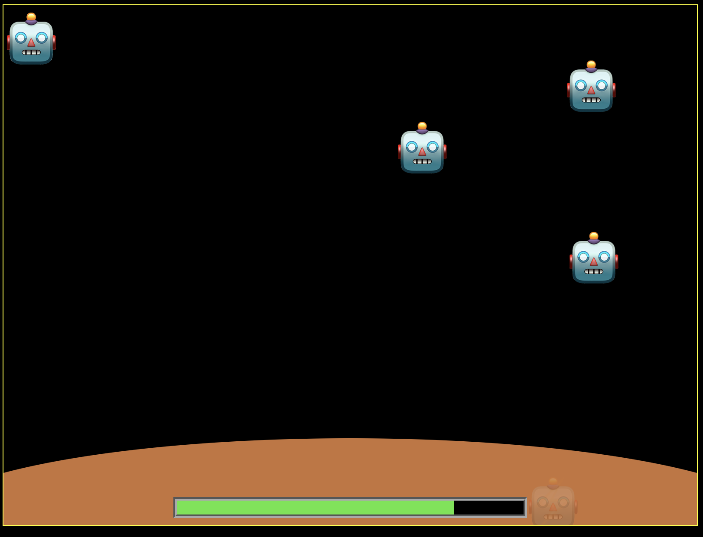

# DSA-DEFENDER

Protect the planet DSA against the evil AI-robots! And beware - as soon as one AI gets to the planet, two more will spawn. Lose attention for a few seconds, and the planet will be overrun and lost to the AIs.

Click a robot to **kill** it, and it will be gone for good, but if it reaches the bottom of the screen, it will infect the planet - making it lose health - as well as spawn another robot, thus increasing the number of attackers.

---
The game is nearly complete, but unfortunately a requirement is that the list of enemies cannot be a JavaScript array, with the ability to push and splice, so something else must be done.
For now the list is implemented with a StaticArray - a bit like an old-timey C or Java array - but I'm sure that something better could be used ...

Please assist by forking and fixing the code - you can easily spot all the TODOs.